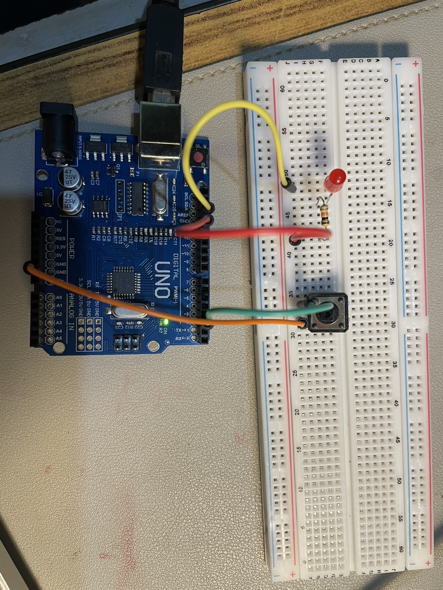
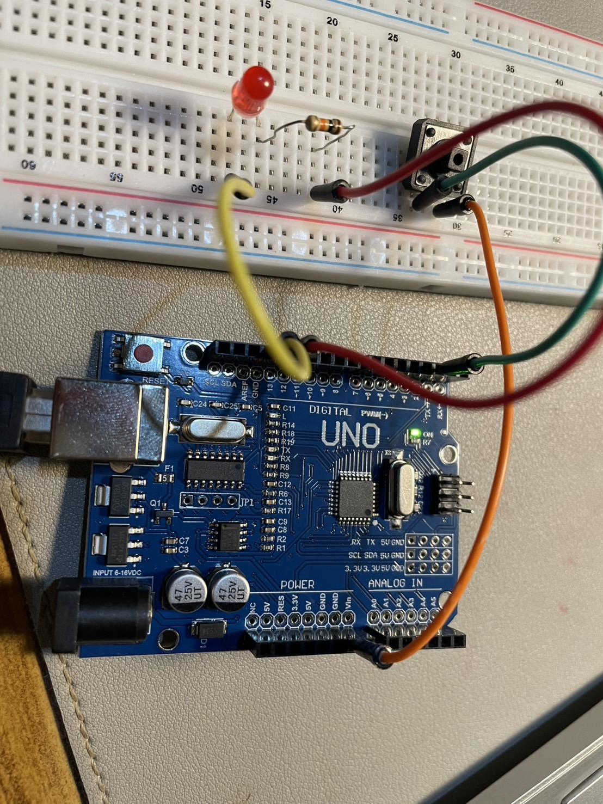

# Button-LED-Arduino
Control an LED with a push button using Arduino UNO.
------------------------------------------------------

# Button-Controlled LED System using Arduino UNO

A simple Arduino project that lets you turn an onboard or external LED on and off using a push-button. Great for learning digital input/output and pull-up resistors, and building a portfolio for future space-tech or embedded systems work.
 
This project is part of a learning path in embedded systems and basic electronics.

  
[View License](./LICENSE)

--------------------------------------------------------

## 📖 Description

This project demonstrates how to read a push-button as a digital input (using the Arduino’s internal pull-up resistor) and control an LED as a digital output. When the button is pressed, the LED lights; when the button is released, the LED turns off.

------------------------------------------------------

## 🔧 Hardware

- *Arduino UNO R3*  
- *Push-button* (any tactile switch)  
- *LED* (5 mm, any color)  
- *220 Ω resistor* (for the LED)  
- Jumper wires  
- Breadboard  

----------------------------------------------------

## 📐 Wiring

1. *LED*  
   - Longer leg (anode) → through 220 Ω resistor → *Digital Pin 13*  
   - Shorter leg (cathode) → *GND*  

2. *Push-button*  
   - One terminal → *Digital Pin 2*  
   - Opposite terminal → *GND*  
   - (Arduino’s INPUT_PULLUP takes care of the pull-up resistor internally)

If your switch spans four breadboard rows, just use the two pins that disconnect/connect when pressed.


---------------------------------------------------

## 💻 Code

```cpp
const int buttonPin = 2;     // Pin connected to the button
const int ledPin    = 13;    // Pin connected to the LED

void setup() {
  pinMode(ledPin, OUTPUT);           // Configure LED pin as output
  pinMode(buttonPin, INPUT_PULLUP);  // Configure button pin as input with internal pull-up
}

void loop() {
  int buttonState = digitalRead(buttonPin);

  if (buttonState == LOW) {          // Button pressed (reads LOW)
    digitalWrite(ledPin, HIGH);      // Turn LED on
  } else {                           // Button released
    digitalWrite(ledPin, LOW);       // Turn LED off
  }
}
```
------------------------------------------------------------------------------
## 📸 Real Project Photo



This is the actual breadboard setup for the button-controlled LED system.

-------------------------------------------------------------------------------
**How It Works**
1. Internal Pull-Up
	- INPUT_PULLUP holds the pin at HIGH by default.
	- Pressing the button connects the pin to GND → reads LOW.
2. Button Reading
	- digitalRead(buttonPin) returns:
	- LOW (0) when pressed
	- HIGH (1) when released
3. LED Control
	- If buttonState == LOW → LED ON
	- Otherwise → LED OFF

⸻-----------------------------------------------------------------------------

**Author**
	Nattacha Longthong 
- Aspiring student computer engineer interested in embedded systems and space technology.

**My profile**
  https://github.com/NattachaLongthong
